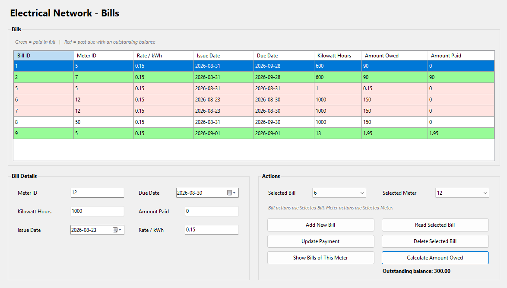

# Electrical Network Billing System

Billing management feature of an accounting automating application for private generator comapny
Built using C# WinForms and SQLite.

## Features

- Save, read, update and delete bills
- Per meter total amount owed calculation
- Visually highlighting past-due bills and paid off bills.
- Filter/prioritize bills of a specific meter.
- Automatic local database initialization
- SQLite local persistence

## Tech Stack

- C#
- Windows Forms
- .NET Framework 4.7.2
- SQLite
- System.Data.SQLite

## Application

